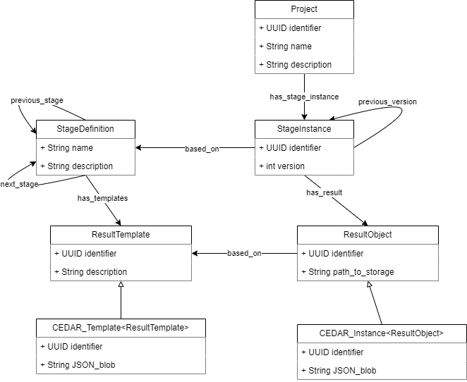

# ELSA lifecycle tool server

## How to run?

Install Go on your system https://go.dev/doc/install

### Windows?
Also install mingw-w64 GCC through https://www.msys2.org/. GCC is used to run C code.

Enable C code to run using Go, since sqlite relies on it (see [go.mod](./go.mod))

```bash
go env -w CGO_ENABLED=1
```


To run the project locally in development mode:

```bash
go run .
```


# Seeding the database

The recommended way to seed the database (clear and insert demo data) is to use the dedicated seeder CLI:

```bash
go run cmd/seed/main.go
```

This will load all seed data from the `database/seeds/` directory (including JSON and JSON-LD files) and populate the database accordingly.

You can also specify a custom database path by setting the `DB_PATH` environment variable:

```bash
DB_PATH="/tmp/my-elsa.db" go run cmd/seed/main.go
```

## Seed Files and Schemas

All seed data is located in the `database/seeds/` directory. The following files are used:

### users.json
- **Schema:**
	- `ID` (string, UUID)
	- `Email` (string)
	- `PasswordHash` (string)

### lifecycles.json
- **Schema:**
	- `Title` (string)
	- `Description` (string)
	- `General` (string, markdown)
	- `Introduction` (string, markdown)

### phases.json
- **Schema:**
	- `Number` (integer)
	- `Title` (string)
	- `Description` (string)
	- `LifecycleID` (integer, foreign key)

### tools.json
- **Schema:**
	- `Title` (string)
	- `Description` (string)
	- `URL` (string)
	- `Cover` (string)
	- `Tags` (string)
	- `Type` (string)
	- `FormFile` (string, path to JSON-LD in `database/seeds/forms/`)

### reflections.json
- **Schema:**
	- `Title` (string)
	- `Description` (string)
	- `FormFile` (string, path to JSON-LD in `database/seeds/forms/`)
	- `PhaseID` (integer, foreign key)

### reflection_answers.json
- **Schema:**
	- `Form` (string, JSON)
	- `BinaryEvaluation` (integer)
	- `ReflectionID` (integer, foreign key)
	- `UserID` (string, UUID)

### journals.json
- **Schema:**
	- `Title` (string)
	- `Description` (string)
	- `FormFile` (string, path to JSON-LD in `database/seeds/forms/`)
	- `PhaseID` (integer, foreign key)

### journal_answers.json
- **Schema:**
	- `Form` (string, JSON)
	- `JournalID` (integer, foreign key)
	- `UserID` (string, UUID)

### recommendations.json
- **Schema:**
	- `ReflectionID` (integer, foreign key)
	- `ToolID` (integer, foreign key)
	- `BinaryEvaluation` (integer)

### recommendation_answers.json
- **Schema:**
	- `Form` (string, JSON)
	- `File` (string, optional)
	- `RecommendationID` (integer, foreign key)
	- `UserID` (string, UUID)

### forms/ (directory)
- Contains referenced JSON-LD form files, e.g.:
	- `value_sensitive_design.jsonld`
	- `reflection_phase1.jsonld`
	- `generic_journal_form.jsonld`

**Warning:** Seeding will clear and repopulate the relevant tables. Only use this in development or when you want to reset the database.

## Class diagram
First draft of the class / model diagram can be found below. This is made using drawio where the xml metadata is encapsulated in the .png metadata. This can be edited in VS Code using the [Draw.io Integration plugin](https://marketplace.visualstudio.com/items?itemName=hediet.vscode-drawio).



## Configuration: CORS_ALLOW_ORIGINS

You can override allowed CORS origins with the environment variable `CORS_ALLOW_ORIGINS`.
Provide a comma-separated list of origins. The server supports simple glob-style wildcards:

- `*` matches any sequence of characters
- `?` matches a single character

Examples:

- Allow only a specific origin:

	CORS_ALLOW_ORIGINS="http://example.com"

- Allow localhost with any port and a subdomain pattern:

	CORS_ALLOW_ORIGINS="http://localhost:*,https://*.example.org"

Notes:

- Patterns are converted to regular expressions internally. For safety, malformed patterns are ignored.
- If the variable is empty or unset, the server defaults to `http://localhost` and `http://localhost:*`.

## Configuration: DB_PATH

The server uses a SQLite database file. By default the project uses the file at `database/db/elsa.db`.

You can override the path to the SQLite database file with the environment variable `DB_PATH`.

Examples:

- Use a custom database file:

	DB_PATH="/tmp/my-elsa.db"

- Use the default (unset the variable):

	unset DB_PATH

Notes:

- If `DB_PATH` is not set or is empty, the server falls back to `database/db/elsa.db`.
- The path can be absolute or relative to the project working directory.

When running inside the provided Docker image the application runs from `/app`, so the container-friendly default path is:

	/app/database/db/elsa.db

Use an absolute `DB_PATH` when running the container to avoid ambiguity.

# Run as Docker image


### Seeding the database in Docker

To seed the database when running in Docker, run the seeder CLI inside the container. For example:

```bash
docker run --rm -e DB_PATH="/app/database/db/elsa.db" -v $(pwd)/database:/app/database ghcr.io/maastrichtu-biss/elsa-lifecycle-server go run cmd/seed/main.go
```

Adjust the `DB_PATH` and volume mounts as needed for your setup.

**Warning:** Seeding will clear and repopulate the relevant tables. Only use this in development or when you want to reset the database.

