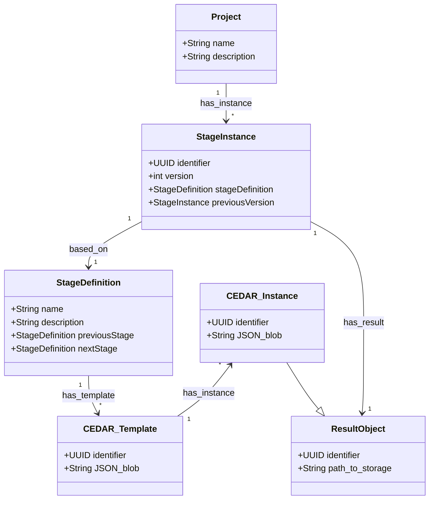

# ELSA lifecycle tool server

## class diagram

```mermaid
classDiagram
  Project "1" --> "*" StageInstance : has_instance
  StageInstance "1" --> "1" StageDefinition : based_on
  StageDefinition "1" --> "*" CEDAR_Template : has_template
  StageInstance "1" --> "1" ResultObject : has_result
  CEDAR_Instance "*" <-- "1" CEDAR_Template : has_instance
  CEDAR_Instance --|> ResultObject

  class Project{
    +String name
    +String description
  }
  class StageDefinition{
    +String name
    +String description
    +StageDefinition previousStage
    +StageDefinition nextStage
  }
  class ResultObject{
    +UUID identifier
    +String path_to_storage
  }
  class CEDAR_Template{
    +UUID identifier
    +String JSON_blob
  }
  class StageInstance{
    +UUID identifier
    +int version
    +StageDefinition stageDefinition
    +StageInstance previousVersion
  }
  class CEDAR_Instance~ResultObject~{
    +UUID identifier
    +String JSON_blob
  }
  
```
